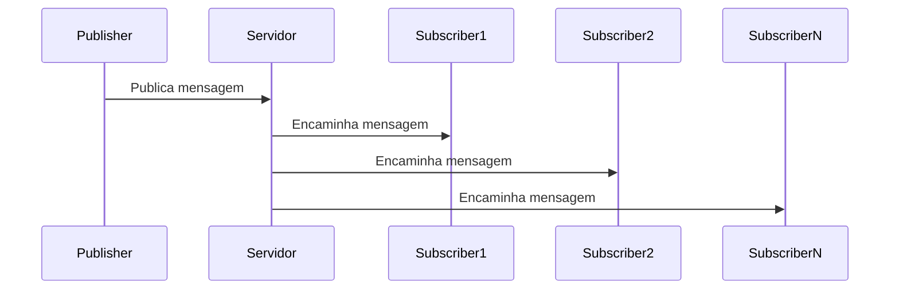

# Sistemas Distribuidos 

Repositório para armazenar os trabalhos feitos durante a disciplina de Sistemas Distribuidos da Universidade Federal Fluminense

# Trabalho 1 

## Sistema de PubSub com gRPC em Java

Um sistema simples de publicação/assinatura (PubSub) implementado com gRPC em Java, usando Maven como gerenciador de dependências.

## 📋 Pré-requisitos

- Java JDK 17+
- Maven 3.6+
- IDE de sua preferência (opcional)

```bash
sudo apt install openjdk-21-jdk
sudo apt install maven
```

## 🛠️ Configuração do Projeto

1. Clone o repositório:
```bash
git clone https://github.com/ArthurPxto/sistemas_distribuidos
cd grpc-pubsub
```

2. Compile o projeto:
```bash
mvn clean compile
```

## 🚀 Como Executar

### 1. Iniciar o Servidor

Abra um terminal e execute:
```bash
mvn clean package -Prun-server
```

### 2. Iniciar Assinantes (Subscribers)

Em terminais separados, execute:
```bash
mvn exec:java -Dexec.mainClass="com.example.pubsub.Subscriber"
```

Você pode iniciar múltiplos assinantes simultaneamente.

### 3. Publicar Mensagens (Publisher)

Em outro terminal, execute:
```bash
mvn exec:java -Dexec.mainClass="com.example.pubsub.Publisher"
```

## 🔧 Estrutura do Projeto

```
grpc-pubsub/
├── src/
│   ├── main/
│   │   ├── java/com/example/pubsub/
│   │   │   ├── PubSubServer.java      # Servidor gRPC
│   │   │   ├── PubSubServiceImpl.java # Implementação do serviço
│   │   │   ├── Publisher.java         # Cliente publicador
│   │   │   └── Subscriber.java        # Cliente assinante
│   │   └── proto/
│   │       └── pubsub.proto           # Definição do serviço gRPC
├── pom.xml                            # Configuração do Maven
└── README.md
```

## 💡 Funcionamento

1. O **Servidor** mantém uma lista de assinantes ativos
2. **Publicadores** enviam mensagens ao servidor
3. O servidor distribui as mensagens para todos os **Assinantes** conectados
- Assim que um novo assinante se interessa pelo assunto, ele recebe todas as mensagens anteriores
4. Assinantes recebem as mensagens em tempo real

## 🛑 Encerrando a Aplicação

Pressione `Ctrl+C` em cada terminal para encerrar os processos.

## 📚 Dependências Principais

- gRPC (1.64.0)
- Protocol Buffers (3.25.3)
- Maven Compiler Plugin (3.11.0)

## 🔄 Fluxo de Mensagens



## 🐛 Solução de Problemas

Se encontrar erros de compilação:
```bash
mvn clean compile
```

Para ver logs detalhados:
```bash
mvn exec:java -Dexec.mainClass="com.example.pubsub.PubSubServer" -X
```
# Trabalho 2

# Projeto de Monitoramento de Sinais Vitais com Spark, Kafka e IA

Este projeto simula a leitura de sinais vitais de pacientes, realiza pré-processamento com Spark Structured Streaming, envia os dados para o Kafka, e utiliza um modelo de aprendizado de máquina para classificar os dados em três categorias: `normal`, `alerta` ou `emergência`.

## ⚙️ Tecnologias utilizadas

- Apache Kafka
- Apache Spark 4.0.0
- PySpark
- scikit-learn
- Confluent Kafka Python client (`confluent_kafka`)
- Docker (para Kafka/Zookeeper)
- Pandas
- joblib

## 📁 Estrutura do Projeto

ML/
.
├── atifacts/
├── libs/
    └── jsr305-3.0.0.jar
├── output/
    └── sinais_vitais.csv
├── gerador.py
├── pre_precessor.py
├── training.py
├── consumer_ia.py
├── consumer.py
├── docker-compose.yaml
├── requirements.txt
├── modelo_risco.pkl
└── README.md

## 🔧 Requisitos

- Python 3.12
- Java 8+
- Apache Maven
- Apache Spark 4.0.0 instalado manualmente
- Kafka rodando localmente (pode usar Docker)

---

## 📦 Instalação das dependências Python

```bash
python3 -m venv venv
source venv/bin/activate
pip install -r requirements.txt
```

---

## ⚠️ Dependência ausente: `jsr305-3.0.0.jar`

O pacote `jsr305:3.0.0` **não é encontrado automaticamente pelo Spark**. Você precisa fazer o seguinte:

### Baixe o arquivo `jsr305-3.0.0.jar` manualmente e instale com o Maven:

```bash
mvn install:install-file \
  -Dfile=jsr305-3.0.0.jar \
  -DgroupId=com.google.code.findbugs \
  -DartifactId=jsr305 \
  -Dversion=3.0.0 \
  -Dpackaging=jar
```

---

## 🚀 Executando o pré-processador com Spark

Use o comando abaixo para rodar o script com a dependência Kafka:

```bash
spark-submit \
  --repositories https://repo1.maven.org/maven2 \
  --packages org.apache.spark:spark-sql-kafka-0-10_2.13:4.0.0 \
  pre_precessor.py
```

---

## 💡 Fluxo do Projeto

1. **Sensores geram sinais vitais** → enviados para o Kafka (`sinais-vitais`)
2. **`pre_precessor.py`** consome os sinais vitais, classifica o risco com regras simples, e publica no tópico `sinais-processados`
3. **`consumidor_ia.py`** recebe os dados e alimenta o modelo de IA treinado

---

## ✅ Execução da IA

Após o `pre_precessor.py` estar em execução e publicando no Kafka, você pode iniciar a IA com:

```bash
python consumidor_ia.py
```

---

## 📊 Treinamento de modelo

```bash
python treinamento.py
```

Gera um modelo salvo em disco com `joblib` que será usado pela IA.

---

## 🧠 Métricas de desempenho

O modelo de regressão logística obteve os seguintes resultados:

```
              precision    recall  f1-score   support
      alerta       0.73      0.81      0.77        69
  emergência       0.79      0.66      0.72        47
      normal       0.81      0.81      0.81        47
    accuracy                           0.77       163
   macro avg       0.78      0.76      0.77       163
weighted avg       0.77      0.77      0.77       163
```

---

## 🐳 Kafka com Docker (opcional)

```bash
# Subir Kafka com Docker
docker-compose up -d

# Entrar no container do Kafka
docker exec -it kafka bash

# Criar o tópico de sinais-vitais criados pelo gerador
kafka-topics --create --topic sinais-vitais --bootstrap-server localhost:9092 --partitions 1 --replication-factor 1

# Criar o topico sinais-processados criados pelo pre-precessor
kafka-topics --create --topic sinais-processados --bootstrap-server localhost:9092 --partitions 1 --replication-factor 1


# Listar os tópicos
kafka-topics --list --bootstrap-server localhost:9092
```

---

## 📝 Observações

- Os arquivos `.jar` devem estar disponíveis localmente se não forem encontrados via pacotes do spark.
- O modelo de IA pode ser trocado por outro (árvore, random forest, etc.).
- O projeto funciona em tempo real com Spark Structured Streaming.