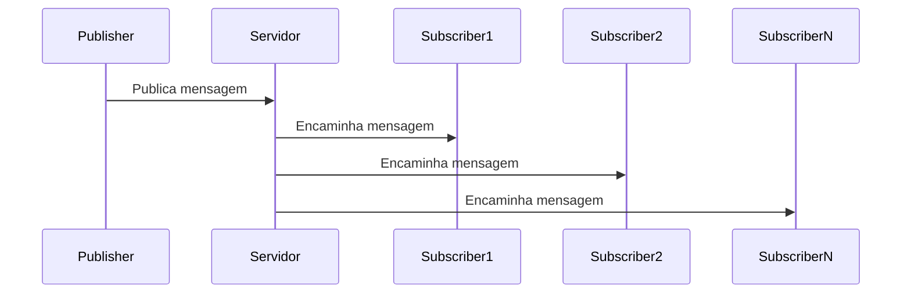

# Sistemas Distribuidos 

Repositório para armazenar os trabalhos feitos durante a disciplina de Sistemas Distribuidos da Universidade Federal Fluminense

# Trabalho 1 

## Sistema de PubSub com gRPC em Java

Um sistema simples de publicação/assinatura (PubSub) implementado com gRPC em Java, usando Maven como gerenciador de dependências.

## 📋 Pré-requisitos

- Java JDK 17+
- Maven 3.6+
- IDE de sua preferência (opcional)

```bash
sudo apt install openjdk-21-jdk
sudo apt install maven
```

## 🛠️ Configuração do Projeto

1. Clone o repositório:
```bash
git clone https://github.com/ArthurPxto/sistemas_distribuidos
cd grpc-pubsub
```

2. Compile o projeto:
```bash
mvn clean compile
```

## 🚀 Como Executar

### 1. Iniciar o Servidor

Abra um terminal e execute:
```bash
mvn clean package -Prun-server
```

### 2. Iniciar Assinantes (Subscribers)

Em terminais separados, execute:
```bash
mvn exec:java -Dexec.mainClass="com.example.pubsub.Subscriber"
```

Você pode iniciar múltiplos assinantes simultaneamente.

### 3. Publicar Mensagens (Publisher)

Em outro terminal, execute:
```bash
mvn exec:java -Dexec.mainClass="com.example.pubsub.Publisher"
```

## 🔧 Estrutura do Projeto

```
grpc-pubsub/
├── src/
│   ├── main/
│   │   ├── java/com/example/pubsub/
│   │   │   ├── PubSubServer.java      # Servidor gRPC
│   │   │   ├── PubSubServiceImpl.java # Implementação do serviço
│   │   │   ├── Publisher.java         # Cliente publicador
│   │   │   └── Subscriber.java        # Cliente assinante
│   │   └── proto/
│   │       └── pubsub.proto           # Definição do serviço gRPC
├── pom.xml                            # Configuração do Maven
└── README.md
```

## 💡 Funcionamento

1. O **Servidor** mantém uma lista de assinantes ativos
2. **Publicadores** enviam mensagens ao servidor
3. O servidor distribui as mensagens para todos os **Assinantes** conectados
- Assim que um novo assinante se interessa pelo assunto, ele recebe todas as mensagens anteriores
4. Assinantes recebem as mensagens em tempo real

## 🛑 Encerrando a Aplicação

Pressione `Ctrl+C` em cada terminal para encerrar os processos.

## 📚 Dependências Principais

- gRPC (1.64.0)
- Protocol Buffers (3.25.3)
- Maven Compiler Plugin (3.11.0)

## 🔄 Fluxo de Mensagens



## 🐛 Solução de Problemas

Se encontrar erros de compilação:
```bash
mvn clean compile
```

Para ver logs detalhados:
```bash
mvn exec:java -Dexec.mainClass="com.example.pubsub.PubSubServer" -X
```

